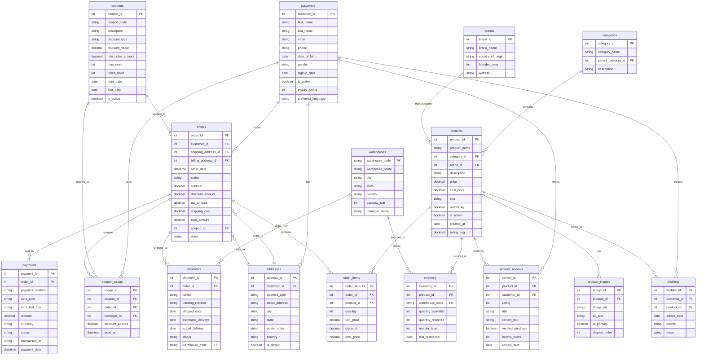

# faker-ecommerce

Generate realistic e-commerce test data for PostgreSQL or Parquet files. This tool creates a complete 16-table e-commerce database schema with realistic data including real brand names, product names, and customer information.

## Features

- **16 interconnected tables** with proper relationships
- **Real-world brand names** (Apple, Nike, Sony, etc.) organized by category
- **Realistic data patterns** (sentiment-aware reviews, proper price ranges)
- **Dual output support**: PostgreSQL or Parquet files
- **Batch processing** for memory-efficient generation of large datasets
- **Progress tracking** with detailed progress bars
- **Configurable sizes** from quick tests to XXL datasets

## Installation

```bash
# Clone the repository
git clone <repository-url>
cd faker-postgres

# Install dependencies with uv
uv sync
```

## Quick Start

### Generate to Parquet files (no database required)

```bash
uv run -m faker_ecommerce --parquet-dir ./data --quick
```

### Generate to PostgreSQL

```bash
# First, set up the database (optional helper script)
./setup_db.sh myuser mypassword ecommerce_db

# Generate data
uv run -m faker_ecommerce --username myuser --database ecommerce_db --quick
```

## Usage

```bash
uv run -m faker_ecommerce [OPTIONS]
```

### Output Options (choose one)

| Option | Description |
|--------|-------------|
| `--username USER` | PostgreSQL username (enables PostgreSQL output) |
| `--database DB` | PostgreSQL database name (required with --username) |
| `--host HOST` | PostgreSQL host (default: localhost) |
| `--port PORT` | PostgreSQL port (default: 5432) |
| `--parquet-dir DIR` | Directory for Parquet output (enables Parquet output) |

### Data Size Options

| Option | Description | Default |
|--------|-------------|---------|
| `--customers N` | Number of customers | 100,000 |
| `--products N` | Number of products | 5,000 |
| `--orders N` | Number of orders (1-5 items each) | 500,000 |
| `--reviews N` | Number of product reviews | 200,000 |
| `--wishlists N` | Number of wishlist items | 50,000 |
| `--coupons N` | Number of coupons | 500 |
| `--batch-size N` | Batch size for writes | 10,000 |

### Size Presets

| Preset | Description |
|--------|-------------|
| `--quick` | Small dataset for quick testing (~2K rows) |
| `--xl` | Large dataset (~10M+ rows) |
| `--xxl` | Extra-large dataset (~50M+ rows) |

## Examples

### Quick test with Parquet output

```bash
uv run -m faker_ecommerce --parquet-dir ./test_data --quick
```

### Medium dataset to PostgreSQL

```bash
uv run -m faker_ecommerce \
    --username ecom_user \
    --database ecommerce \
    --customers 10000 \
    --products 1000 \
    --orders 50000
```

### Large dataset with custom batch size

```bash
uv run -m faker_ecommerce \
    --parquet-dir ./large_data \
    --xl \
    --batch-size 50000
```

### Remote PostgreSQL server

```bash
uv run -m faker_ecommerce \
    --username admin \
    --host db.example.com \
    --port 5432 \
    --database ecommerce \
    --quick
```

## Database Schema

The generated schema includes 16 tables with the following relationships:



### Table Overview

#### Reference Tables
- **categories** - Product categories (Electronics, Clothing, etc.)
- **brands** - Real brand names (Apple, Nike, Sony, etc.)
- **warehouses** - Distribution center locations
- **coupons** - Discount coupons

#### Customer Tables
- **customers** - Customer profiles with demographics
- **addresses** - Billing and shipping addresses

#### Product Tables
- **products** - Products with realistic names and pricing
- **product_images** - Product image records
- **inventory** - Stock levels per warehouse

#### Order Tables
- **orders** - Customer orders with totals
- **order_items** - Individual items in orders
- **payments** - Payment transactions
- **shipments** - Shipping and delivery info

#### Engagement Tables
- **product_reviews** - Customer reviews with sentiment-aware text
- **wishlists** - Customer wishlists
- **coupon_usage** - Coupon redemption tracking

## Output Structure

### PostgreSQL
Tables are created directly in the specified database with appropriate data types.

### Parquet
```
<parquet-dir>/
├── categories.parquet
├── brands.parquet
├── warehouses.parquet
├── customers.parquet
├── addresses.parquet
├── coupons.parquet
├── products.parquet
├── product_images.parquet
├── inventory.parquet
├── orders.parquet
├── order_items.parquet
├── payments.parquet
├── shipments.parquet
├── product_reviews.parquet
├── wishlists.parquet
└── coupon_usage.parquet
```

## Real Brand Names by Category

| Category | Example Brands |
|----------|---------------|
| Electronics | Apple, Samsung, Sony, Dell, HP, Bose |
| Clothing | Nike, Adidas, Levi's, Zara, The North Face |
| Home & Kitchen | Dyson, KitchenAid, Instant Pot, iRobot |
| Beauty | L'Oréal, Estée Lauder, MAC, Fenty Beauty |
| Sports & Outdoors | Nike, Yeti, Garmin, Patagonia, Columbia |
| Books | Penguin Random House, O'Reilly, HarperCollins |
| Toys & Games | LEGO, Nintendo, PlayStation, Hasbro |
| Grocery | Whole Foods, Trader Joe's, Kind, Clif Bar |
